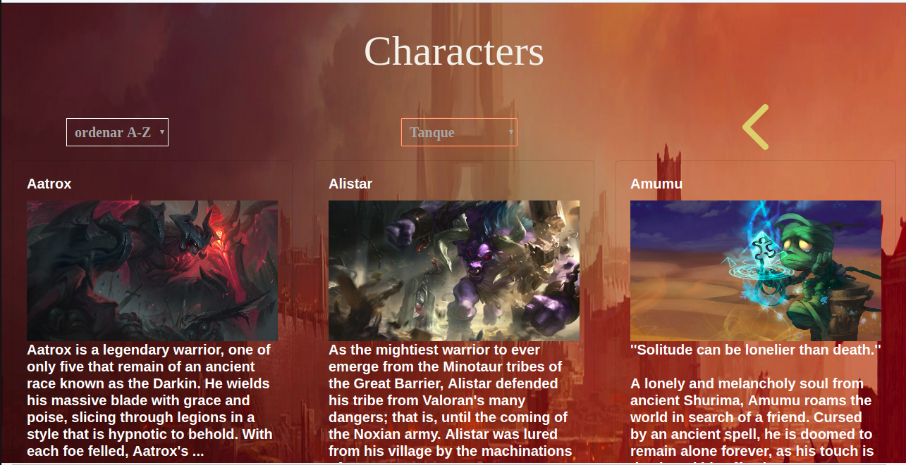

# Champions Data

## Índice

* [Introducción](#preámbulo)
* [Planificación](#planificacion)
* [Consideraciones generales](#consideraciones-generales)
* [Objetivos de aprendizaje](#objetivos-de-aprendizaje)
* [Parte obligatoria](#parte-obligatoria)
* [Consideraciones técnicas](#consideraciones-técnicas)
* [Primeros pasos](#primeros-pasos)
* [Contenido de referencia](#contenido-de-referencia)
* [Checklist](#checklist)

***

 ## Introducción 🚀

**Champions Data** es una aplicación web responsiva que fue hecha pensada en aquellos jugadores que recien estan adentrandose en el universo [**LOL**](https://lan.leagueoflegends.com/es/) y busquen cierta orientación al momento de elegir sus champions.
En ella se puede visualizar a los champions, obtener una breve reseña sobre sus caracteristicas y también conocerlos a travez de un filtro por tipo de juego (rol).

## Planificación 📋

Tras informarnos muy bien sobre los requisitos que proponía el proyecto *Data Lovers* comenzamos por hacer un diagrama de flujo donde podíamos proyectar, a grandes razgos, las caracteristicas que queríamos poner en nuestra aplicacion.
Posteriormente registramos un listado de tareas para el logro de objetivos y con la intención de poder organizarnos de manera eficiente.
Link a *TRELLO*  [**Aqui**](https://trello.com/b/jaVnMsw3/data-lovers).
Creamos nuestro prototipo de baja fidelidad

## Historias de Usuario  📌

## Historia de Usuario 1:

YO COMO jugador nuevo de LOL
QUIERO poder revisar el sitio en distintos dispositivos.
PARA poder conocer mejor LOL y sus campeones

## Historia de Usuario 2:

YO COMO jugador nuevo de lol
QUIERO saber quienes son los personajes con roll mago y sus habilidades
PARA seleccionarlos y jugar

## Historia de Usuario 3:

YO COMO jugador principiante de lol 
QUIERO que la pagina me muestre todos los campeones ordenados por nombre con imagen de ellos 
PARA  saber cual elegir.

## Diseño, criterios de aceptación y test de usabilidad

al tener nuestras historias de usuario, creamos el scketch de baja fidelida, en cual se determino el enfoque que dariamos a nuestra aplicacion,con los feedbacks recidos empezamos a crear el prototipo de alta fidelidad en figma. en el que no grabamos lamentablemente pero recibimos varias criticas constructivas en pos de mejorar nustro diseño.

https://www.figma.com/file/CRl06G4yHrnNoAKT1jcpNhfG/prueba?node-id=0%3A1

algunos de los comentarios recibidos:

*Mejorar background colores muy oscuros
*Pagina mas dinamica
*Menos texto.

al tener los feedbacks, quizimos mejorar en esos criterios,
abarcando la mayoria de los requerimientos solicitados,

desde este punto empezamos con la creacion de nuestra aplicacion;
ya, en este punto nos enfocamos que nuestra aplicacion tuviera un filtro de rol que divide a los personajes en 6 tipos, los cuales son:

*Asesinos
*Magos
*Peleadores
*Tanque
*Soporte
*Tirador

Esta era una de nuestras historia de usuario,otra de nuestra historia de usuario era poder asociar los nombres de los personajes con imagenes, lo cual logramos crear
con el filtro tipo de rol.

Para que sea mas pulcra y de facil entendimiento, se puede ordenar alfabeticamente de A-Z y de Z-A, que este tambien era un requerimeinto poder ordenar el filtro lo cual se logro;

Tambien cabe destacar que se nos pidio poder agregrar un poco de historia del personaje por lo que al filtrar a nuestros personajes abajo de la imagen aparece un pequeña reseña del personaje.

A continuacion agregare alguno de los videos de nuestro test de usabilidad. con el cual terminamos de realizar los cambios finales.

#video 1
https://www.useloom.com/share/675dbded6a7b484da918d3893c59af85

#video 2
https://www.useloom.com/share/7a527dd5019e4d77a5ea2379c2037177

#video 3
https://www.useloom.com/share/a07ab5df2e774aba83ac389db5bdc1c4

## Modo de uso 📹

* Al ser una aplicacion pensada en principiantes de LOL(league of legends).
  nuestro enfoque fue para el principiante.

como pagina de presentacion.

* 

en nuestra 2da pantalla es donde esta los select de tipo rol y ordenar alfabeticamente.

En esta pagina tambien aparece una pequeña historia de los personajes.
## Conclusion 🎁

Nuestro último objetivo es seguir generando iteraciones hasta el que el producto final sea de total agrado y conveniencia para nuestro usuario. 

Hecho por ***Fabiola Tapia*** y ***Carolina Méndez***.

Checklist

** Usa VanillaJS.
 **No hace uso de this.
**Pasa linter (npm pretest)
 **Pasa tests (npm test)
 *Pruebas unitarias cubren un mínimo del 70% de statements, functions y lines y branches.
 **Incluye Definición del producto clara e informativa en README.md.
 **Incluye historias de usuario en README.md.
 **Incluye sketch de la solución (prototipo de baja fidelidad) en README.md.
 **Incluye Diseño de la Interfaz de Usuario (prototipo de alta fidelidad) en README.md.

 **Incluye el listado de problemas que detectaste a través de tests de usabilidad en el README.md.
 
 **UI: Permite ordenar data por uno o más campos (asc y desc).
 **UI: Permite filtrar data en base a una condición.

