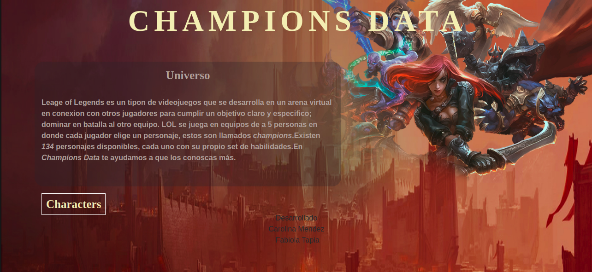
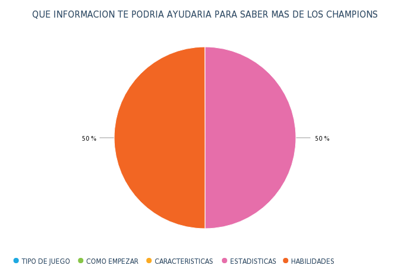
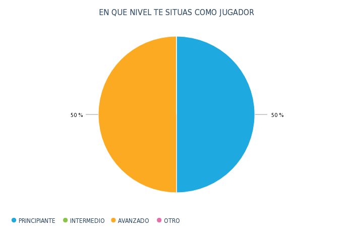
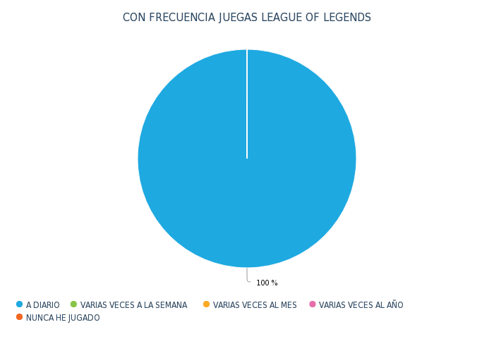
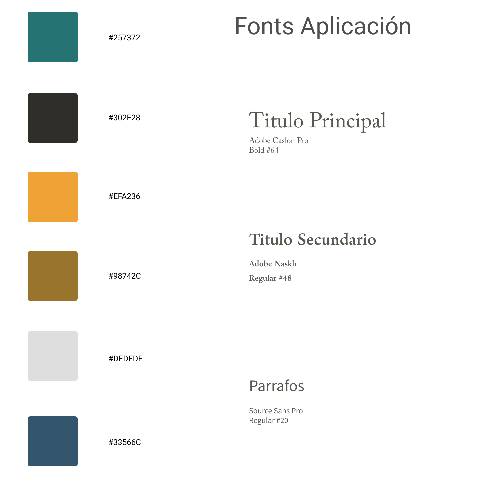
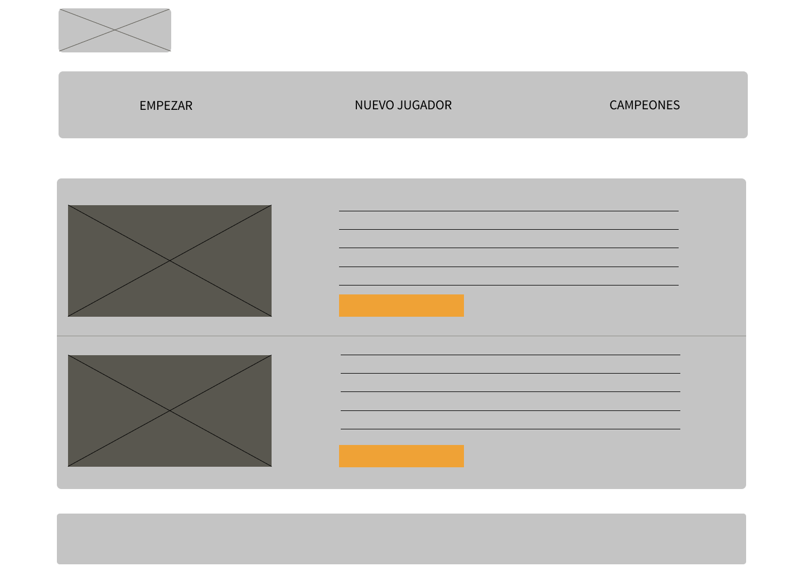
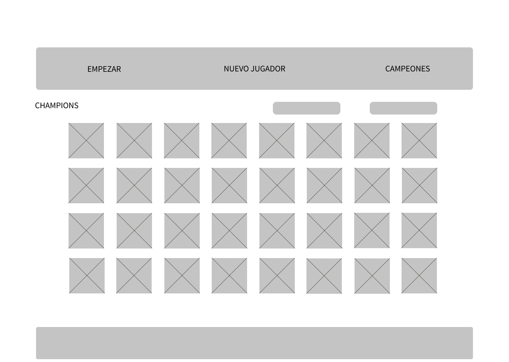
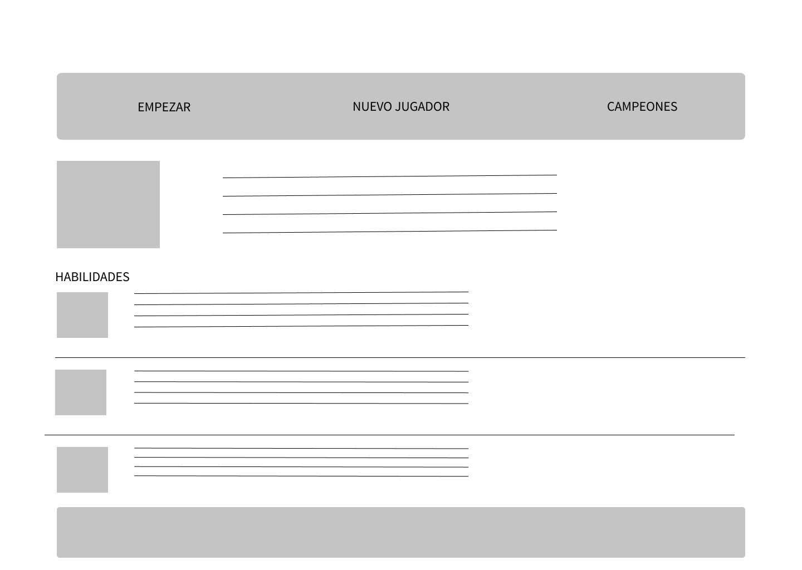

# Champions Data

## Introducción 🚀

**Champions Data** es una aplicación web responsiva que fue hecha pensada en aquellos jugadores que recien estan adentrandose en el universo [**LOL**](https://lan.leagueoflegends.com/es/) y busquen cierta orientación al momento de elegir sus champions.
En ella se puede visualizar a los champions, obtener una breve reseña sobre sus caracteristicas y también conocerlos a travez de un filtro por tipo de juego (rol).

## Planificación 📋

Tras informarnos muy bien sobre los requisitos que proponía el proyecto *Data Lovers* comenzamos por hacer un diagrama de flujo donde podíamos proyectar, a grandes razgos, las caracteristicas que queríamos poner en nuestra aplicacion.
Posteriormente registramos un listado de tareas para el logro de objetivos y con la intención de poder organizarnos de manera eficiente.
Link a *TRELLO*  [**Aqui**](https://trello.com/b/jaVnMsw3/data-lovers). Para, posterior a eso, meternos de lleno a escribir las historias de usuario.

## Historias de Usuario  📌

Este proyecto nos hizo implementar la idea de las Historias de usuario para así pensar en ellos y sus necesidades con el fin de llevarlo a la aplicación web transformadas en Criterios de aceptación. Aqui las principales historias de usuario:

### Historia de Usuario 1:

Yo como juegador principiante QUIERO ver la aplicacion web desde el computador PARA entender el universo LOL desde mi casa antes de ponerme a jugar.

### Historia de Usuario 2:

YO COMO jugador nuevo de LOL
QUIERO poder revisar el sitio en distintos dispositivos.
PARA poder conocer mejor LOL y sus campeones

### Historia de Usuario 3:

YO COMO jugador nuevo de lol
QUIERO saber quienes son los personajes con roll mago y sus habilidades
PARA seleccionarlos y jugar.

### Historia de Usuario 4:

YO COMO jugador principiante de lol QUIERO que la pagina me muestre la cantidad de champiosn de tipo mago PARA saber cuantos son.

## Diseño, criterios de aceptación y test de usabilidad

Lo primero fue un proceso de encuestas que arrojaron estos datos:

Tras retener ciertas ideas de lo que nuestro usuario prefería inciamos el proceso de búsqueda sobre como eran las webs más usuales con el tema (League of Legends) para de esta forma determinar los colores mas comunmente usados y su tipografía.

De acuerdo a esta información trazamos un wireframe determinando el enfoque que le queríamos dar a nuestra aplicación.

Finalmente trazamos el Prototipo de alta fidelidad que vendrá en nuestra proxima iteración del producto. Esta disponible en la herramienta Figma.

 https://www.figma.com/file/H7LojqvutjQGcOFxZahliu4M/Colores%2FFuentes?node-id=8%3A21

##Test de usabilidad

A continuacion algunos de los videos de nuestro test de usabilidad. con el cual terminamos de realizar los cambios finales.

#video 1 https://www.useloom.com/share/675dbded6a7b484da918d3893c59af85

#video 2 https://www.useloom.com/share/7a527dd5019e4d77a5ea2379c2037177

#video 3 https://www.useloom.com/share/a07ab5df2e774aba83ac389db5bdc1c4

## Conclusion 🎁
Nuestro último objetivo es seguir generando iteraciones hasta el que el producto final sea de total agrado y conveniencia para nuestro usuario.

Hecho por Carolina Méndez.

